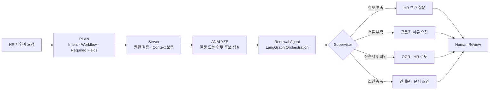

### 복잡한 현실의 문제를, 신뢰할 수 있는 AI Workflow로 설계합니다.

## About Me

사용자의 자연어 요청이 실제 업무로 안전하게 이어지도록 **의도를 분석하고, 필요한 정보를 확인하며, 실행 흐름을 제어하는 AI 시스템**을 개발합니다.

현재는 LangGraph와 FastAPI를 중심으로 Agent Orchestration과 AI Serving을 다루고 있습니다. AI의 결과를 곧바로 확정하지 않고, 낮은 신뢰도와 누락 정보, Provider 실패를 사람이 검토할 수 있는 상태로 전환하는 설계에 관심이 있습니다.

## Featured Project · FOWOCO

### E-9 외국인근로자 HR·행정업무를 구조화하는 AI 업무보조 서비스

`2026.06 — 2026.08` · `8인 팀 프로젝트` · `Supervisor Agent & AI Serving`

[Organization](https://github.com/fowoco) · [AI Runtime](https://github.com/fowoco/ai) · [Service API](https://github.com/fowoco/server) · [Web Client](https://github.com/fowoco/client)

FOWOCO는 계약·체류·서류·신고 업무에 흩어진 정보와 기한을 하나의 Workflow로 연결합니다. AI가 요청을 분석하고 문서와 안내문 초안을 준비하되, 최종 검토와 승인은 HR 담당자가 수행하도록 설계했습니다.

### My Contribution

**Supervisor Agent와 AI Runtime의 기반을 설계하고 구현했습니다.**

- FastAPI 기반 AI Runtime의 초기 구조와 내부 API 환경 구성
- Intent·Ambiguity 분석 Pipeline과 누락 Slot 탐지 구현
- PLAN과 ANALYZE를 분리해 모델 판단과 Server 데이터 조회의 책임 경계 설계
- LangGraph 기반 재계약 Renewal Workflow, State, Node, Supervisor 구현
- HR 추가 질문, 근로자 서류 요청, OCR 검토, 문서 생성 분기 연결
- Hugging Face Intent 분류기와 규칙 기반 Guardrail·Fallback을 결합한 Hybrid 구조 구현
- OCR 및 Language Assistant 결과를 Workflow State로 연결하는 Bridge 구현
- 여권·외국인등록증 누락 시 자동 진행하지 않고 근로자 요청 단계로 전환
- API 계약, Fixture, 단위·통합 테스트를 함께 작성해 Agent 분기와 응답 안정성 검증

> AI가 업무 상태를 직접 확정하지 않도록 판단과 실행을 분리했습니다. 정보가 부족하거나 결과를 신뢰하기 어려운 경우 자동 처리 대신 `Human Review`로 안전하게 전환합니다.

### Architecture & Engineering Focus

| 영역 | 적용 내용 |
| --- | --- |
| Agent Orchestration | LangGraph State Graph, Supervisor, 조건부 분기, 실행 재개 |
| AI Serving | FastAPI Internal API, Pydantic Schema, 비동기 Workflow 실행 |
| Intent Analysis | Hugging Face BERT, Guardrail, Fallback, Ambiguity Detection |
| Workflow Integration | OCR·Language·Document Agent Adapter와 상태 연결 |
| Safety | Missing Slot, Low Confidence, Provider Failure의 Fail-safe 처리 |
| Quality | Pytest 기반 Agent·API·Contract Test, Ruff, CI 자동 검증 |

### FOWOCO Platform

| Repository | Responsibility | Stack |
| --- | --- | --- |
| [`fowoco/ai`](https://github.com/fowoco/ai) | Agent Workflow, Intent, OCR, Language, Document AI | Python, FastAPI, LangGraph |
| [`fowoco/server`](https://github.com/fowoco/server) | 인증, HR Workflow, 승인, 감사, AI Adapter | Java, Spring Boot, PostgreSQL |
| [`fowoco/client`](https://github.com/fowoco/client) | HR Dashboard와 근로자 Mobile UX | React, TypeScript |
| [`fowoco/knowledge`](https://github.com/fowoco/knowledge) | 공식 근거, Workflow Context, Label과 Evaluation Set | Python, Data Pipeline |
| [`fowoco/infra`](https://github.com/fowoco/infra) | Container, CI/CD, Cluster Deployment | Docker, GitHub Actions, k3s |

## Tech Stack

## More Projects

| Project | What I Built | Stack |
| --- | --- | --- |
| [ProPresenter Remote System](https://github.com/EHWIYA/pro-presenter-front-end) | 성경·찬양 자료 생성과 현장 송출을 연결하는 모바일 PWA 및 NAS BFF | React, TypeScript, FastAPI, Docker |
| [Hwiya IoT](https://github.com/EHWIYA/home-assistant-front-end) | Home Assistant 기반 에어컨·콘센트·멀티탭 제어 및 자동화 | React, FastAPI, PWA, Firebase |
| [AI Book Management](https://github.com/EHWIYA/mini-6-back) | OpenAI와 Cloudinary를 활용한 AI 도서 표지 생성 및 도서 관리 | Spring Boot, React, OpenAI |
| [Ledger Weight](https://github.com/EHWIYA/ledger-weight-back-end) | WebSocket 기반 실시간 카드 게임 서버 | FastAPI, WebSocket, Python |

---

**Designing AI that knows when to act, when to ask, and when to hand control back to people.**

